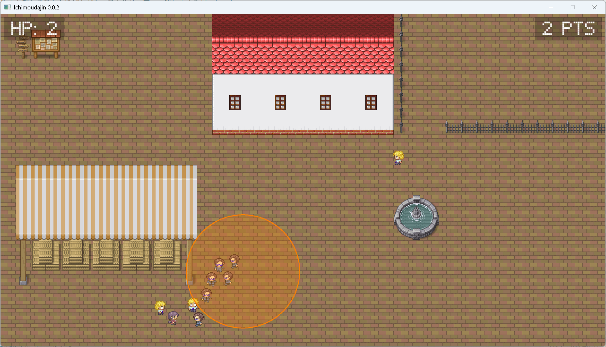

# 一網打尽！

  
次々と現れる敵から逃げながら、敵を集めて囲って消しまくるゲームです。

## 操作方法
- 移動  
  上下左右キー / 左スティック
- 攻撃範囲指定  
  指定の位置にマウスカーソルを合わせ、マウスの左ボタンを押し続ける  
- 攻撃開始  
  マウスの左ボタンを離す  
- フルスクリーンモード切り替え  
  F11キー  
- ゲーム終了  
  Escキー  

## 開発環境の作り方
1. 下記クレジットを参考に開発ツールを用意します。
1. ダウンロードしてきた素材は、assetsフォルダ内の対応するフォルダに置いてください。  
   例えば、画像・アニメーションならimagesフォルダに、フォントならfontsフォルダに置いてください。  
1. 一部の素材のファイル名を下記に変更してください。  
   - OpenSans\[wdth,wght\].ttf -> OpenSans.ttf
1. Visual Studio Codeでこのリポジトリを開き、実行とデバッグからDebug構成で実行し、エラーがあれば取り除きます。  
1. 正常に実行されたら、一旦プログラムを終了してbuildwin.bat（Windowsの場合）を実行します。  
1. コンパイルが成功したら「（ゲーム名）.exe」が作成されます。
1. プログラムが正常に動けば、開発環境は完成です。

## クレジット

### 開発ツール
- [Visual Studio Code](https://code.visualstudio.com/)
- [Ebitengine](https://ebitengine.org/)
  by [Hajime Hoshi](https://hajimehoshi.com/)
  ([Apache License 2.0](https://www.apache.org/licenses/LICENSE-2.0))
- [Tiled](https://www.mapeditor.org/)
  by Thorbjørn Lindeijer

### 画像・アニメーション
- [ぴぽや32×32 出力画像＋α](https://pipoya.net/sozai/assets/charachip/character-chip-2/#%E3%81%B4%E3%81%BD%E3%82%8432%C3%9732_%E5%87%BA%E5%8A%9B%E7%94%BB%E5%83%8F%EF%BC%8B%CE%B1)
  by [ぴぽやネット](https://pipoya.net/)
- [ウディタ２用マップセット](https://pipoya.net/sozai/assets/map-chip_tileset32/#%E3%82%A6%E3%83%87%E3%82%A3%E3%82%BF%EF%BC%92%E7%94%A8%E3%83%9E%E3%83%83%E3%83%97%E3%82%BB%E3%83%83%E3%83%88)
  by [ぴぽやネット](https://pipoya.net/)

### フォント
- [LCD Phone](https://www.dafont.com/lcd-phone.font)
  by [Grafito Design](https://www.dafont.com/raul-andres-perez-canseco.d1591)
- [Open Sans](https://github.com/googlefonts/opensans/blob/main/fonts/variable/OpenSans%5Bwdth%2Cwght%5D.ttf)
  ([SIL Open Font License, Version 1.1](https://openfontlicense.org/open-font-license-official-text/))
